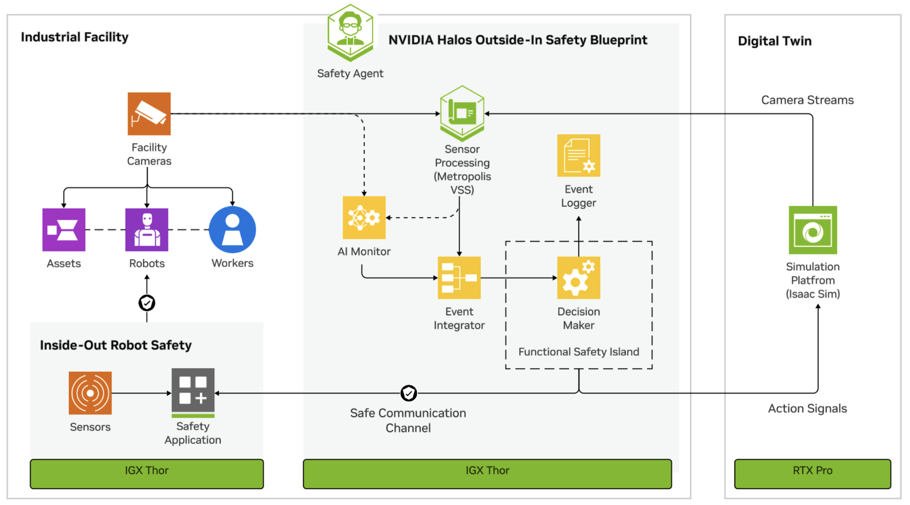

<h2>NVIDIA Halos Outside-In Safety Blueprint</h2>

> **Open-source on-ramp for physical AI safety (early access).**
> Built for prototyping, evaluation, and integration development — not for production use in safety-related systems without your own certified safety layer.
> See [SAFETY_NOTICE.md](SAFETY_NOTICE.md).

### Table of Contents
- [Overview](#overview)
- [Software Components](#software-components)
- [Profiles](#profiles)
- [Repository Structure](#repository-structure)
- [Documentation](#documentation)
- [Prerequisites](#prerequisites)
- [Hardware Requirements](#hardware-requirements)
- [Quickstart Guide](#quickstart-guide)
- [Parallel Terms in context of Safety-Core](#parallel-terms-in-context-of-safety-core)
- [Contributing](#contributing)
- [License](#license)

## Overview

NVIDIA Halos Outside-In Safety Blueprint is a reference architecture for building safety agents and part of [NVIDIA Halos for Robotics](https://www.nvidia.com/en-us/ai-trust-center/halos/robotics), a full-stack comprehensive safety system for robotics and physical AI.

NVIDIA Halos Outside-In Safety Blueprint extends robot perception beyond onboard sensors by using external infrastructure cameras, AI perception, and safety logic to accelerate development of real-time safety solutions that also maximize operational throughput. 
Running on NVIDIA IGX and available as open source, it enables robots to safely operate alongside workers at higher efficiency while dynamically adapting to complex environments.

An agent built using the blueprint will leverage fixed infrastructure cameras and vision agents to monitor and analyze workspace conditions and adjust robot behavior in real-time.

The reference use case is Automated Trailer Loading: at a warehouse loading dock, fixed cameras and AI perception monitor workers and autonomous forklifts, and the Safety Core determines in real time when it is safe for the forklift to enter the docked trailer.

NVIDIA Halos Outside-In Safety is built from three pillars:

1. **AI Perception**: a perception backend with NVIDIA Metropolis Blueprint for video search and summarization (swappable). See [`ai-perception/`](ai-perception/).
2. **Safety Core**: the safety engine — event integration, decision-making, and communication. See [`safety-core/`](safety-core/).
3. **Closed-Loop Testing**: the software-in-the-loop and hardware-in-the-loop harness that drives the loop with NVIDIA Isaac Sim and feeds the safety decision back to the simulated equipment. See [`closed-loop-testing/`](closed-loop-testing/).

## Software Components

The three pillars connect through a perception event stream: cameras feed AI perception, which publishes detections to the Safety Core, which emits a decision.

## Profiles

| Profile | Description |
|---------|-------------|
| `base` | Safety Core on an existing perception feed; the MUTE / UNMUTE decision is rendered as the VST `halo_safety` overlay. No simulation. Runs on x86 by default, or on IGX Thor (CCPLEX or FSI; see [`halos_thor.md`](skills/hoisa-deploy-profile/references/halos_thor.md)). |
| `sil` | Full single-host closed loop: NVIDIA Isaac Sim drives a forklift, and the safety decision is fed back to the simulated forklift over ROS. |
| `hil` 🚧 | Hardware-in-the-loop: the Safety Core runs on an NVIDIA Thor device. Under development. |

Deploy a profile with the [`hoisa-deploy-profile`](skills/hoisa-deploy-profile/) skill or by hand (see the [Quickstart Guide](#quickstart-guide)).

## Repository Structure

| Directory | Description |
|-----------|-------------|
| [`ai-perception/`](ai-perception/) | Perception integration: pointer to the reference VSS Blueprint backend and the event-stream integration contract. |
| [`safety-core/`](safety-core/) | The safety engine and reference decision-maker apps (CMake). |
| [`closed-loop-testing/`](closed-loop-testing/) | SIL / HIL harness: Isaac Sim, communication layer, MediaMTX, the Safety Core deployment, and helper scripts. |
| [`skills/`](skills/) | Agentic skills (for Claude Code) to deploy and operate the system. |
| [`deployments/`](deployments/) | Docker Compose front door: `compose.yaml` plus per-profile run-envs (`base` / `sil` / `hil`). |
| [`tools/`](tools/) | Repo-wide tooling. |
| [`whitepaper/`](whitepaper/) | Technical narrative. |

## Documentation

For detailed instructions and additional information about this blueprint, please refer to the [official documentation](https://docs.nvidia.com/halos-outside-in/latest/index.html).

## Prerequisites

- An NGC account with Early-Access entitlement to the `nvidia/halos-outside-in` team (for the Safety Core image and SIL data) and an [NGC API key](https://org.ngc.nvidia.com/setup/api-keys).
- Docker + Docker Compose and the NVIDIA Container Toolkit (see [System Requirements](#system-requirements) for versions).

## Hardware Requirements

Requirements depend on the profile:

- **`base`** (inference: VSS Blueprint perception + Safety Core) follows the VSS Blueprint hardware requirements. See the [VSS prerequisites](https://docs.nvidia.com/vss/latest/prerequisites.html).
- **`sil`** (full closed loop, adds NVIDIA Isaac Sim, which needs a GPU with RT cores). See the [Halos SIL prerequisites](https://docs.nvidia.com/halos-outside-in/latest/sil/prerequisites.html).

## Quickstart Guide

Deploy the perception backend (VSS Blueprint) first, then a Halos profile.

### Deploy with the agent

**Ideal for:** hands-off, end-to-end deployment.

The [`hoisa-deploy-profile`](skills/hoisa-deploy-profile/) skill brings up both stacks (the VSS Blueprint perception backend and the chosen profile) and runs the test scenario. See [`skills/`](skills/) for install and usage.

### Docker Compose Deployment

**Ideal for:** deploying by hand on your own host or bare-metal instance.

1. Deploy the [NVIDIA VSS Blueprint](https://github.com/NVIDIA-AI-Blueprints/video-search-and-summarization) perception backend first. It publishes the detection events the Safety Core consumes.
2. Fill `deployments/profiles/<profile>.env`, then `docker compose --env-file profiles/<profile>.env up -d`.

For full steps, see [`skills/hoisa-deploy-profile/references/halos_deploy.md`](skills/hoisa-deploy-profile/references/halos_deploy.md) or the [Deployment guide](https://docs.nvidia.com/halos-outside-in/latest/deployment/index.html).

#### System Requirements

- OS:
    - x86 hosts: Ubuntu 24.04
    - IGX Thor: Jetson Linux BSP (Rel 38.5)
- NVIDIA Driver:
    - 580.105.08 (x86 hosts with Ubuntu 24.04)
    - 580.00 (IGX Thor)
- NVIDIA Container Toolkit: 1.17.8+
- Docker Engine: 28.3.3 <= Docker Engine < 29.5.0
- Docker Compose: v2.39.1+
- NGC CLI: 4.10.0+

> **Docker upper bound:** Docker Engine 29.5.0+ may fail pulling NGC-hosted images. Use Docker Engine 28.3.3 or another supported version below 29.5.0.

See [`skills/hoisa-deploy-profile/references/prerequisites.md`](skills/hoisa-deploy-profile/references/prerequisites.md) for installation details.

## Parallel Terms in context of Safety Core

For legacy reasons, several parallel terms are used interchangeably in the context of the Safety Core.

At its core, the Safety Core is a software framework that analyzes the output of a perception system against a given set of safety conditions and evaluates the appropriate action based on the detected safety event. It is also referred to as the **Outside-In Safety Framework (OISF)**. The former name for the Outside-In Safety Framework is the **Proactive Safety Framework (PSF)**. The term PSF is most evident in the source code and in the names of the compiled binaries.

For example, the black box is the entity that provides a unified API for logging. In the source code it is referred to as the **PSB (Proactive Safety Black Box)**, and the resulting binary is `libnvpsb.so`.

The following are further examples of parallel terms used across the software architecture and the source code:

1. **Event-integrator**
   - Referred to in source as: Proactive Safety Supervisor (PSS)
   - Resulting binary: `nvpss_daemon`

2. **Decision-maker**
   - Referred to in source as: Proactive Safety Decision (PSD)
   - Resulting binaries: `libnvpsd.so` and `nvpsd_gateway`

Similarly, the abstractions over POSIX message queues and sockets are also prefixed with PSF.

## Contributing

This project is currently not accepting external contributions. See [CONTRIBUTING.md](CONTRIBUTING.md).

## License

Apache-2.0. See [LICENSE](LICENSE). Third-party components are listed in [LICENSE-3rd-party.txt](LICENSE-3rd-party.txt).
