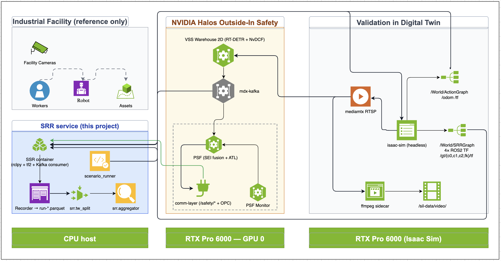
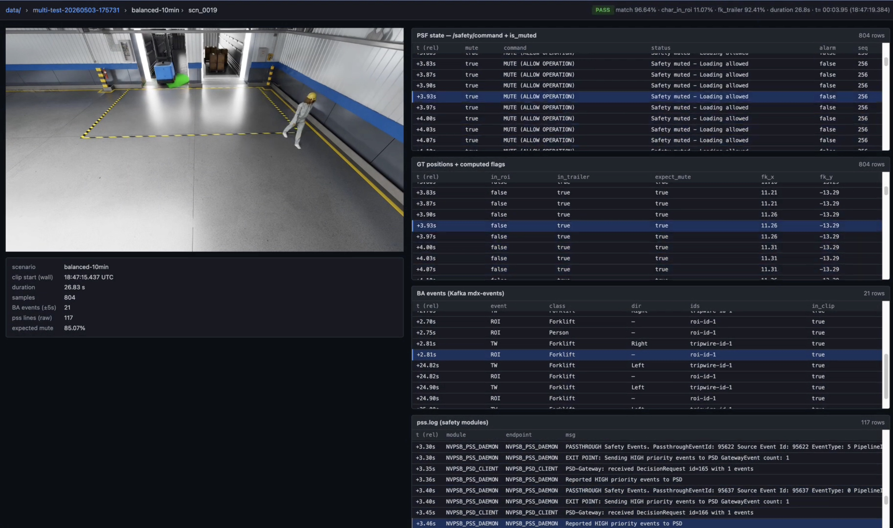

# Regression Reporter (SRR)

**Scenario Recorder + Reporter** for the Halos SIL stack. Runs scenarios in Isaac Sim, records ground truth + safety-system state at 30 Hz, splits by forklift tripwire crossings, and produces graded per-clip reports + per-clip review videos.

Lives at `closed-loop-testing/regression-reporter/` in this repo. Its Claude Code skill is a sibling at `skills/hoisa-generate-regression-report/` and the browser viewer at `tools/srr-debug-viewer/`.



> **Quick start**: see **[docs/quickstart.md](docs/quickstart.md)** — end-to-end runbook from Halos SIL deploy → clone SRR → install the skill → run a multi-test → view results in the debug viewer. ~90 min first-time setup.



*SRR debug viewer — per-clip page with scrub-synced PSF / GT / BA / pss.log panels.*

## Layout

```
regression-reporter/
├── srr-service/         # Python pkg, Dockerfile, docker-compose.yml — the SRR container
├── scripts/             # Shared run-time orchestration (skill + manual users)
│   ├── run_multi.sh                  # multi-scenario orchestrator
│   ├── live_clip_monitor.py          # ROS subscriber, prints TW crossings
│   ├── safety_critical_unmute.py     # post-run safety-critical analysis
│   └── snapshot_pss.sh               # snapshot PSF syslog slice into a run dir
├── scenarios/           # Test fixtures — behavior trees, scenes, debug utilities
│   ├── behavior-trees/               # 6 scenarios × 3 chars: IRA 1.6 *.bt.json (Isaac 6.0 form, canonical source)
│   ├── scenes/                       # SRR-prepped USD scenes + navmesh.json (data)
│   ├── tools/                        # behavior-tree generator + validator (host)
│   ├── isaac-scripts/                # Script Editor utilities (scene prep, NavMesh bake/debug, /gt/* publishers)
│   ├── host-scripts/                 # Host-side rclpy / USD probes (verify GT topics, dump prim positions)
│   └── README.md
├── halos-integration/   # Glue: sync SRR fixtures into the sibling isaac-sim/sil tree
│   ├── sync_to_halos.sh              # copies SRR scenes/behavior-trees into isaac-sim/sil
│   ├── default_config_ros.yaml.template   # SRR-shape IRA 1.6 config (simulation_duration, behavior_tree groups, scene path)
│   └── README.md                     # how SRR plugs into the Halos SIL stack
└── docs/
    └── quickstart.md    # end-to-end runbook (Halos SIL deploy → SRR run → viewer)
```

Related, elsewhere in this repo:

- `../../skills/hoisa-generate-regression-report/` — the Claude Code skill (was `srr-pipeline/srr-skill/`)
- `../../tools/srr-debug-viewer/` — browser viewer for per-clip MP4 + sync panels
- `../isaac-sim/sil/` — Halos Isaac SIL asset tree; the `isaac-sim` container bind-mounts it, and `sync_to_halos.sh` copies SRR fixtures into it

## Setup

1. **Prerequisites**:
   - Halos SIL deployed from the GitHub `halos-outside-in-safety` repo (provides
     the shared profile env at `$HALOS_ENV_FILE`, e.g. `deployments/profiles/sil.env`)
   - Docker + Docker Compose v2
   - VSS calibration JSON at the path defined in `.env`

2. **Configure**:
   ```bash
   cp .env.example .env
   # edit .env (absolute paths — sourced from >1 working dir):
   #   HALOS_COMPOSE_DIR  → <repo>/deployments
   #   HALOS_ENV_FILE     → <repo>/deployments/profiles/sil.env
   #   HALOS_SIL_DIR      → <repo>/closed-loop-testing/isaac-sim/sil
   #   CALIBRATION_JSON   → your VSS calibration sample-data path
   ```

   The `.env` lives at this dir's root. `docker compose` is invoked from
   `srr-service/`, so point that dir's env at the same file once:
   ```bash
   ln -s ../.env srr-service/.env
   ```
   so `docker compose` auto-resolves `${HALOS_ENV_FILE}` / `${CALIBRATION_JSON}`.

3. **Build and run the SRR container**:
   ```bash
   cd srr-service
   docker compose up --build -d
   docker logs -f srr
   ```

   Expect log line: `SRR service up; sample_hz=30, out_dir=/app/runs, ...` then
   `Awaiting: ros2 service call /srr/record SetBool ...`. If you see
   `"HALOS_ENV_FILE" variable is not set`, the symlink at `srr-service/.env`
   is missing — recreate with `ln -s ../.env srr-service/.env`.

## Usage

### Run a multi-scenario test

```bash
./scripts/run_multi.sh in-roi:300 psf-edge:300 balanced:600
# or:
./scripts/run_multi.sh all
```

5 sweep scenarios: `in-roi`, `psf-edge`, `psf-clear`, `balanced`, `fast` — these are what `all` (default 5 min each) and `full` (recommended per-scenario durations) run. Plus `fixed`, a deterministic baseline (hand-authored, always-in-ROI; reproducible regression anchor) that's runnable by explicit name (`./scripts/run_multi.sh fixed`) but **not** part of `all`/`full`. Override any duration via `name:seconds`.

### Read the report

After a run, top-level summary lands at:

```
$RUNS_HOST_DIR/multi-test-YYYYMMDD-HHMMSS/summary.md
```

Per-clip detail at `<run-label>/reports/scn_*.md`, MP4s at `<run-label>/videos/scn_*.mp4`.

For interpretation guide (what each metric means, drill-down workflow for FAIL clips), see [`skills/hoisa-generate-regression-report/references/06_interpret_report.md`](../../skills/hoisa-generate-regression-report/references/06_interpret_report.md).

### Run via Claude Code skill

The `skills/hoisa-generate-regression-report/` directory (sibling of this dir in the repo) contains a Claude Code skill that orchestrates the multi-test pipeline with agent-driven progress checks (no fixed sleep timers). Symlink it into your `.claude/skills/`:

```bash
ln -s "$(git rev-parse --show-toplevel)/skills/hoisa-generate-regression-report" ~/.claude/skills/hoisa-generate-regression-report
```

Then invoke from Claude Code: *"run SRR multi-test for in-roi"*, *"regression-test PSF on all scenarios"*, etc.

## Key concepts

- **Scene split** — each forklift trailer-tripwire crossing (x = `TW_X` from calibration JSON) delimits one clip (~40 s)
- **Match%** — frame-by-frame agreement (30 Hz) between GT-derived expected mute state and PSF actual mute state
- **Mute / Unmute correctness** — broken out per direction so safety-critical "alarm suppressed when person present" failures are visible separately from "false alarm when zone is clear"
- **BA event matching** — for each GT event, finds nearest BA (mdx-events Kafka) event within ±3 s. BA fires at bbox-edge crossing (not centroid), so TW IN typically lags +2 s and TW OUT leads −1.5 s (explained in `06_interpret_report.md`)

## Test outputs

Test runs (`runs/`, parquets, MP4s) are **gitignored**. Each run produces ~50–100 MB of parquet + ~200–500 MB of video. To share a specific run, zip the directory and attach it to a GitHub issue or release.

## License

Licensed under Apache-2.0 (see the repository `LICENSE`).

Maintainers: Huy To &lt;hnto@nvidia.com&gt;, Huy Bui &lt;hbui@nvidia.com&gt;
