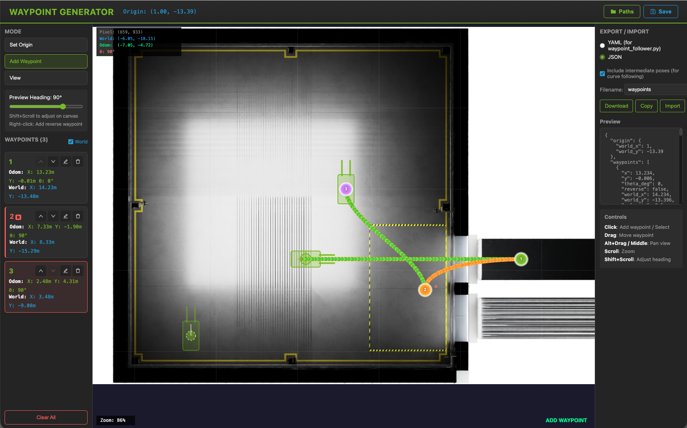
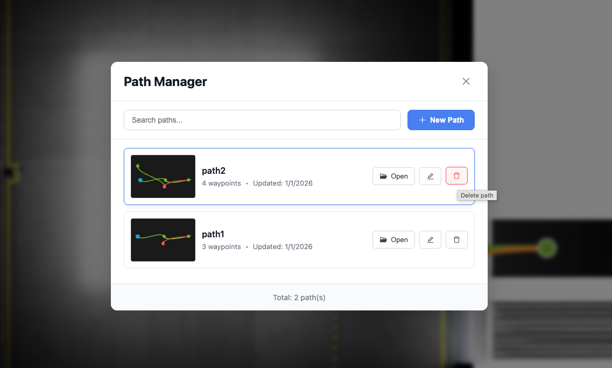

# Forklift Waypoint Generator



A web-based tool to visually create waypoints for forklift navigation on the warehouse floor plan.

## Features

- **Visual waypoint editing** on Top.png warehouse image
- **Pan/Zoom** navigation (Alt+Drag or Middle Mouse to pan, Scroll to zoom)
- **Origin point selection** for odom frame reference
- **Heading control** via Shift+Scroll or slider
- **Drag-and-drop** waypoint reordering
- **Export** to JSON (waypoints plus interpolated poses for curve following)
- **Import** existing waypoint files (JSON or YAML)
- **Path Management System** - Save, open, delete, and rename paths with Redux store 
- **Auto-save** to localStorage for persistent storage

## Quick Start

Requires Node.js 20.19+ or 22.12+ (Vite 7 requirement).

```bash
# Install dependencies
npm install

# Start development server
npm run dev

# Open http://localhost:5173
```

## Usage

### Basic Workflow

1. **Set Origin**: Click "Set Origin" mode and click on the map where the forklift starts (or use "Use Default Forklift Start")

2. **Add Waypoints**: Switch to "Add Waypoint" mode, then click on the map to add waypoints. Use Shift+Scroll to adjust heading before clicking.

3. **Edit Waypoints**: Click on waypoints to select, drag to move, or use the sidebar to edit coordinates directly.

4. **Save Path**: Click the 💾 **Save** button in the header to save your path for later use.

5. **Export**: Download or copy the JSON waypoint file.

### Path Management

- **📁 Paths Button**: Open Path Manager to view all saved paths
- **Create New Path**: Save your current work with a name
- **Open Existing Path**: Load previously saved paths
- **Rename Path**: Double-click on path name or use the ✏️ button
- **Delete Path**: Remove paths you no longer need with the 🗑️ button
- **Search Paths**: Filter paths by name in the Path Manager

## Coordinate Systems

- **Pixel**: Image coordinates (Top.png is 1920x1080)
- **World**: Isaac Sim global coordinates (meters)
- **Odom**: Relative to origin point

## Output Format

The JSON export (including `poses`) is the input format of the SIL forklift controller: `closed-loop-testing/forklift-controller/robot_controller.py` loads it via `--path <file>.json`. In the compose deployment, set `FORKLIFT_WAYPOINT_FILE` to your exported file or replace `closed-loop-testing/forklift-controller/waypoints/waypoints.json`.

### JSON (for the forklift controller)
```json
{
  "origin": {
    "world_x": 1.0,
    "world_y": -13.39
  },
  "waypoints": [
    {
      "x": 12.44,
      "y": -0.01,
      "theta_deg": 0,
      "reverse": false,
      "world_x": 13.44,
      "world_y": -13.40,
      "velocity": 0.5,
      "note": "Waypoint 1"
    }
  ],
  "poses": [
    {"x": 1.0, "y": -13.39, "theta": 0.0},
    {"x": 1.5, "y": -13.39, "theta": 0.0}
  ],
  "segments": [
    {
      "from_waypoint": 0,
      "to_waypoint": 1,
      "reverse": false,
      "pose_count": 21
    }
  ]
}
```

**Fields:**
- `origin`: Robot starting position in world coordinates
- `waypoints`: User-defined waypoints with odom (x, y) and world coordinates
- `poses`: Intermediate points for smooth curved path (consumed by the forklift controller)
- `segments`: Path segment info with reverse flag for each waypoint pair

## Controls

| Action | Control |
|--------|---------|
| Pan view | Alt+Drag or Middle Mouse |
| Zoom | Scroll |
| Add waypoint | Left Click (in Add mode) |
| Adjust heading | Shift+Scroll |
| Select waypoint | Click on waypoint |
| Move waypoint | Drag waypoint |

## Calibration

The bundled `public/Top.png` and the calibration values come from the [VSS blueprint sample data](https://github.com/NVIDIA-AI-Blueprints/video-search-and-summarization/tree/v3.2.1/deploy/docker/industry-profiles/warehouse-operations/warehouse-2d-app/calibration/sample-data/warehouse-loading-dock-3cams-synthetic) for the same warehouse scene that ships with `closed-loop-testing`:
- Scale factor: 49.51 pixels/meter
- Default forklift start: (1.0, -13.39) in world coordinates

The blueprint calibration measures pixel Y from the image bottom; `src/config/calibration.json` stores the equivalent values for this tool's top-anchored formula.

To adapt the tool to a different scene, replace `public/Top.png` and update `src/config/calibration.json` with that scene's calibration (converting the pixel Y convention as noted above), then set `defaultForkliftStart` from the forklift prim's transform in Isaac Sim.
